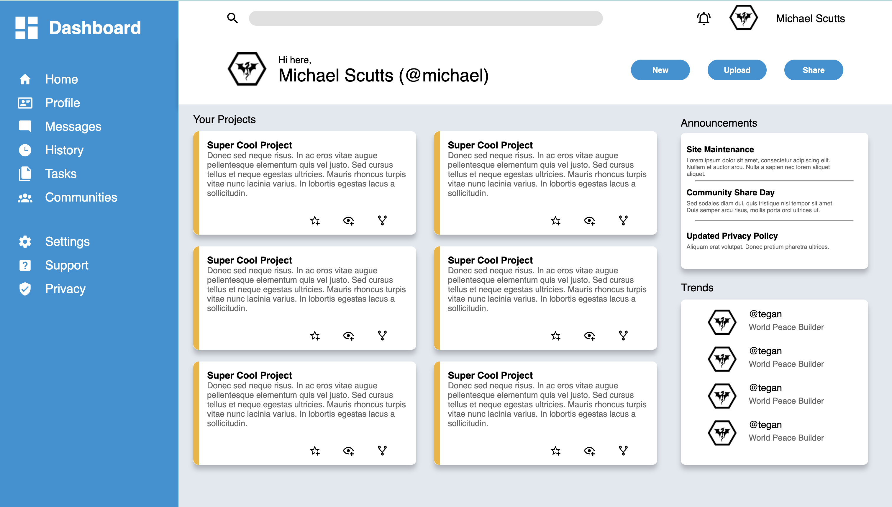

# Admin-Dashboard

Welcome to the Admin-Dashboard repository! This repository serves the purpose of practicing and displaying my skills in using grid to postition elements on a website using:

- HTML
- CSS

# To view the website

- Follow this link - [Admin-Dashboard](https://raimeiraikiri.github.io/Sign-up-Form/)

# Notice 

This website is not responsively designed - yet!

# About

This website is a project designed by the people at 'The Odin Project' - They tasked me with replicating this website design using what I have learned in previous projects and self learning:

    
For those who want to checkout the project here is a link - [Odin Project](https://raimeiraikiri.github.io/Admin-Dashboard/)

# Features

- Purely aesthetic

# Result

In case it looks odd on your screen size (the website is not repsonsively designed) this is the attempted replication of the website above:

# Contributions

1. Start by forking the repository
2. Create a new branch in the forked repository
3. Make any changes you wish
4. Commit and push alterations to the main branch of the forked repository
5. Create a pull request here to get your changes implemented

# License

This project is licensed under the MIT License.